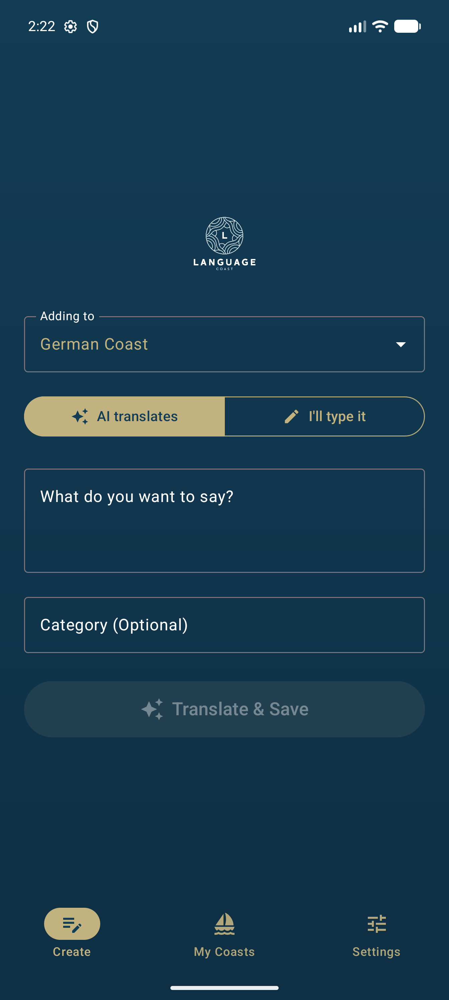
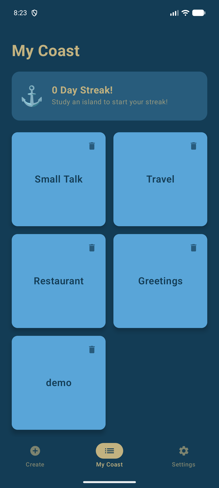
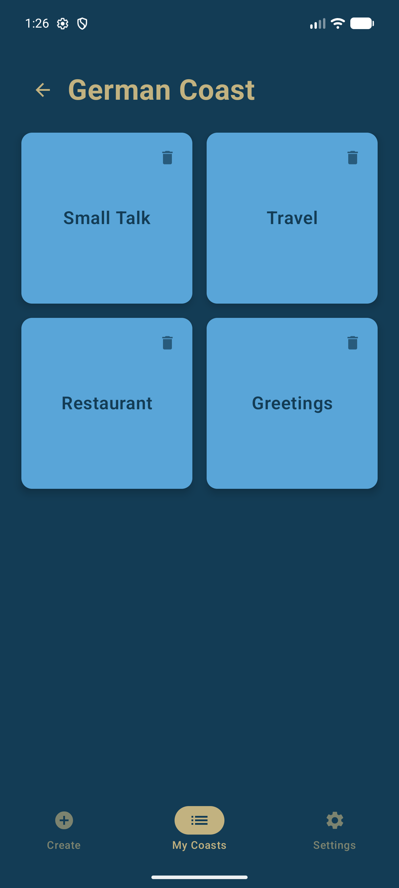
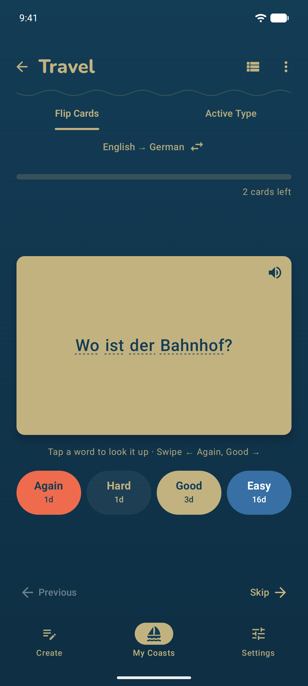
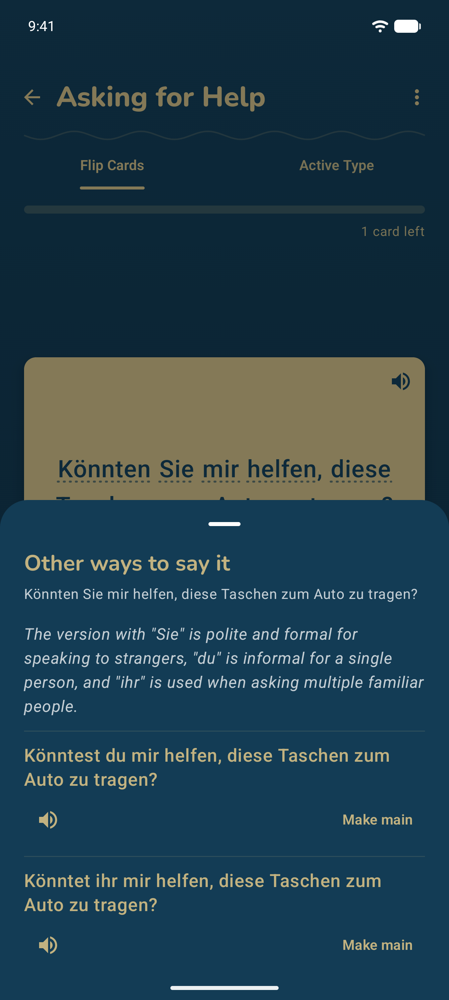
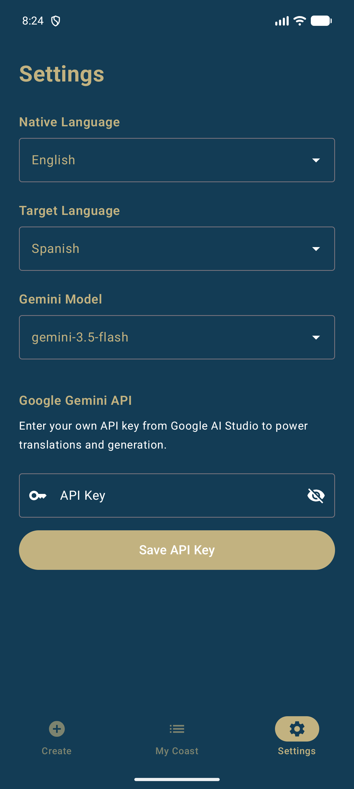
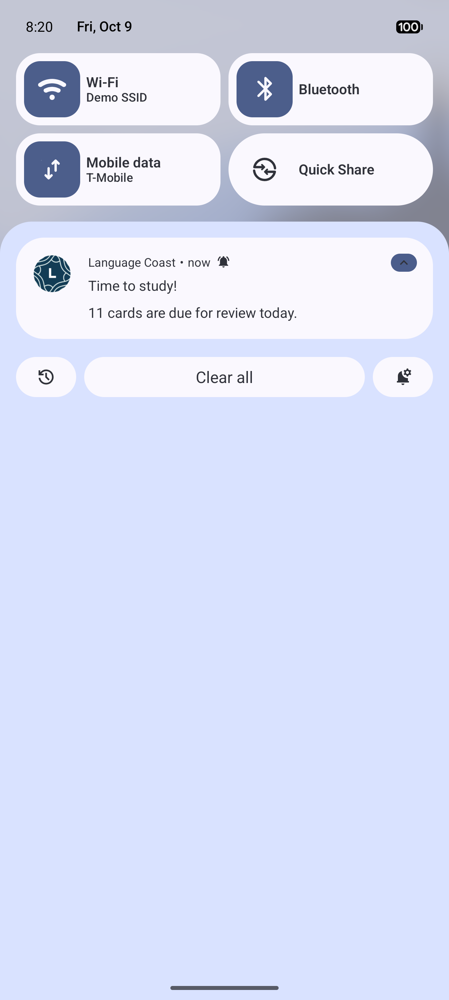
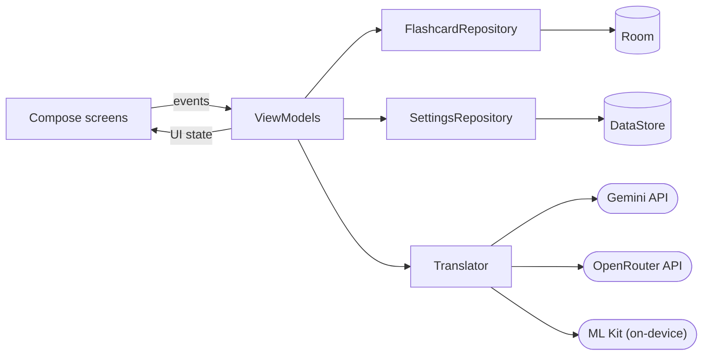

<p align="center">
  
</p>

<h1 align="center">🌊 Language Coast</h1>

<p align="center">
  An AI-powered flashcard app for Android, built with Jetpack Compose, Google Gemini and on-device translation.
</p>

<p align="center">
  <a href="https://github.com/Andreas-Erick/LanguageCoast/actions/workflows/ci.yml"></a>
  
  
  
</p>

---

Language Coast is a flashcard app that changes how you build vocabulary. It combines AI translation with a coastal-themed UI. Each language you learn gets its own **Coast** (e.g. a *German Coast* and an *Icelandic Coast*). Type what you want to say, and the AI translates it and files it into one of that coast's "Language Islands", ready to study.

## 📱 Screenshots

<p align="center">
  
  
  
  
  
  
  
</p>

## ✨ Features

### 🏠 Home screen
- **Today at a glance**: how many cards are due across your coasts, and a *Start reviewing* button that opens the island with the most due cards.
- **Your streak** in the header, the **new card form** with a compact coast picker, and the **cards you added most recently** to that coast.

### 🤖 AI-powered card creation
- **Three ways to translate**, picked in Settings:
  - **On-device** (Google ML Kit): free, private and offline once a language is downloaded (about 30 MB). It only translates, so cards go into the category you type. Covers every app language except Bosnian, Latin and Serbian.
  - **Google Gemini** (`gemini-2.5-flash` by default) for natural, context-aware translations.
  - **OpenRouter**: one API key for many cloud models (GPT, Claude, Llama, …). `openrouter/auto` picks a model for you, or enter any model ID.
- **Auto-categorization**: the cloud models sort each new card into an island such as *Travel*, *Restaurant* or *Greetings*, reusing your existing islands whenever one fits.
- **Icelandic noun rule**: single Icelandic nouns are returned with their definite and plural forms (e.g. *hestur, hesturinn, hestar*).
- **Island emojis**: the cloud models also pick an emoji for each new island (🍽️ *Restaurant*, ✈️ *Travel*).
- **Manual mode**: you can skip the AI and enter your own translation and category.
- **Instant preview with undo**: after saving you see the card that was created and can undo it right away.
- **Alternatives for longer sentences**: for sentences of 6 words or more, Gemini and OpenRouter also suggest up to two other translations with a note on how they differ (e.g. formal vs. informal). They are saved with the card: after flipping it, *2 alternatives* opens a sheet with the note, a read-aloud button for each and *Make main* to swap one with the card's translation. Alternatives also count as correct in Active Type and are included in exports.

### 🏝️ My Coasts
- **One coast per language**: study several languages side by side, each with its own islands. Pick which coast new cards go to right on the Create screen.
- **Language Islands**: on each coast, your vocabulary is grouped into islands by category, each with its emoji, card count and when you last studied it.
- **Progress at a glance**: coasts show how many islands you explored this week.
- **Island card list**: *See cards* in an island's ⋮ menu (or the list icon while studying) shows every card with its translation, alternatives and when it is due next.
- **Search**: the search icon on My Coasts finds cards on every coast by their native text, translation or alternatives, and shows which coast and island each is on.
- **Duplicate hint**: while you type a new card, Create tells you if the coast already has that sentence and on which island.
- **Edit cards**: fix a card's native text, translation or alternatives, or move it to another island, without losing its review progress.
- **Daily streaks**: a streak counter and a dot for each day of the week track your study days.
- **Undo instead of "Are you sure?"**: deleted coasts, islands and cards can be restored from the snackbar.
- **Offline-first storage**: cards are stored locally with **Room**, and preferences with **Jetpack DataStore**.

### 🧠 Study modes
- **Spaced repetition**: cards are scheduled with [FSRS](https://github.com/open-spaced-repetition/awesome-fsrs/wiki/The-Algorithm), the algorithm Anki uses, so each island only asks for the cards that are due. Islands and coasts show how many cards are due, and the daily reminder says how many are waiting. When nothing is due you can still practice all cards.
- **Flip Cards**: classic flashcards with an animated flip. Grade each card *Again*, *Hard*, *Good* or *Easy* (each button shows when the card comes back), or swipe left for *Again* and right for *Good*. *Again* also moves the card to the end of the session.
- **Active Type**: test your recall by typing the translation. Capitalization, punctuation and extra spaces don't count against you, accents do. A correct answer is graded like a flipped card; a wrong one counts as *Again* and the card comes back later in the session.
- **Read aloud**: a speaker button reads the translation in the coast's language, using the voices installed on your phone (free and offline). It only appears when the phone has a voice for that language.
- **Study the other way round**: swap the direction under the study tabs to see the translation first and answer in your native language, training recognition instead of recall. Works with Flip Cards and Active Type, and is remembered for later sessions.
- **Session summary**: finishing an island shows a short celebration with your stats and streak.
- **Built-in dictionary**: tap any word on the back of a card to look it up on **dict.cc**. It uses your language pair when dict.cc has it (dict.cc pairs every language with English or German) and falls back to the English dictionary otherwise.

### 🔔 Study reminders
- A daily reminder, scheduled with **WorkManager**: at a surprise time between 9:00 and 21:00, or at a fixed time you pick in Settings. It can also be turned off.
- **Home-screen widget**: the cards due today and your streak, a gentler nudge than a notification. It refreshes every hour and whenever you leave the app, and tapping it opens the app.

### 📤 Export & import
- **Export to Anki**: save one coast or all of them as a text file that Anki imports with *File › Import*. Each island becomes a subdeck (e.g. *German Coast::Greetings*), and alternatives and notes go on the back of the card. Review progress isn't exported, so cards start fresh in Anki.
- **Export to Markdown**: one table per island, to read, print or keep in your notes app.
- **Import from CSV or tab-separated files**, e.g. a spreadsheet or an Anki notes export. A third column (or Anki's deck column) picks the island, a header row is detected, and cards the coast already has are skipped. Imports can be undone.
- **Full backup and restore**: one JSON file with every coast, island and card including review progress, plus the streak, study days and settings, for moving to a new phone. API keys are left out. Restoring replaces everything after a confirmation, and can be undone.
- Files are saved and opened with the system file picker, so they can go to Downloads, Google Drive and so on. The app needs no storage permission.

### ❓ Built-in guide
- **How to use**: a button in Settings opens a short guide to coasts and islands, creating cards, translation, studying, streaks and reminders, and exporting and importing.

**Supported languages:** all 28 dict.cc languages (Albanian, Bosnian, Bulgarian, Croatian, Czech, Danish, Dutch, English, Esperanto, Finnish, French, German, Greek, Hungarian, Icelandic, Italian, Latin, Norwegian, Polish, Portuguese, Romanian, Russian, Serbian, Slovak, Spanish, Swedish, Turkish, Ukrainian), plus Japanese and Korean without dictionary lookup. The language picker can be searched by English or native name (e.g. *Deutsch*, *Suomi*).

## 🛠️ Tech stack

| Area | Library |
| --- | --- |
| Architecture | MVVM: ViewModels + repositories, unidirectional data flow with `StateFlow` |
| Dependency injection | [Hilt](https://developer.android.com/training/dependency-injection/hilt-android) |
| UI | [Jetpack Compose](https://developer.android.com/compose) + Material 3 (100% Kotlin) |
| Translation | [Google Gen AI Java SDK](https://github.com/googleapis/java-genai) (Gemini), [OpenRouter](https://openrouter.ai/docs) API, [ML Kit Translation](https://developers.google.com/ml-kit/language/translation) (on-device) |
| Database | [Room](https://developer.android.com/training/data-storage/room) |
| Preferences | [Jetpack DataStore](https://developer.android.com/topic/libraries/architecture/datastore) |
| Navigation | [Navigation Compose](https://developer.android.com/jetpack/compose/navigation) with type-safe routes |
| Spaced repetition | [FSRS-5](https://github.com/open-spaced-repetition/awesome-fsrs/wiki/The-Algorithm) with its default parameters (implemented in `data/SpacedRepetition.kt`) |
| Text-to-speech | Android [`TextToSpeech`](https://developer.android.com/reference/android/speech/tts/TextToSpeech) with the voices installed on the phone |
| Background work | [WorkManager](https://developer.android.com/topic/libraries/architecture/workmanager) |
| Testing | JUnit 4, kotlinx-coroutines-test, hand-written fakes |
| CI/CD | GitHub Actions (tests on every push, signed APK on every release tag) |

## 🏗️ Architecture



- **Screens** are stateless: they render a UI state and forward user events to their ViewModel.
- **ViewModels** hold the screen logic, e.g. `StudyViewModel` runs the study session (every grade reschedules the card, *Again* re-queues it, completing a session updates the streak).
- **Repositories** are interfaces with one production implementation each, provided by Hilt. Tests swap them for in-memory fakes, so all ViewModel logic is tested without a device.

## 📁 Project structure

```
app/src/main/java/com/andreaserick/languagecoast/
├── MainActivity.kt          # Entry point, bottom navigation and NavHost
├── data/                    # Repositories, Room entities/DAO, DataStore settings, translators
├── di/                      # Hilt modules
├── navigation/              # Type-safe route definitions
├── notifications/           # Daily study reminder (WorkManager + notification)
├── speech/                  # Reading cards aloud (text-to-speech)
├── ui/
│   ├── coast/               # Each feature has a Screen + ViewModel
│   ├── components/          # Shared composables (screen header, language picker, dropdown, undo snackbar)
│   ├── create/
│   ├── mycoast/
│   ├── settings/
│   ├── study/
│   └── theme/               # Colors, typography and Material theme
└── util/                    # dict.cc lookup helpers
```

## 🚀 Getting started

### Prerequisites
- A recent version of **Android Studio** that supports Android Gradle Plugin 9.2.
- **JDK 21** (Gradle can download it automatically through the toolchain resolver).
- Optionally a **Google Gemini API key** ([Google AI Studio](https://aistudio.google.com/)) or an **OpenRouter API key** ([openrouter.ai](https://openrouter.ai/)). On-device translation needs no key.

### Setup
1. Clone the repository:
   ```bash
   git clone https://github.com/Andreas-Erick/LanguageCoast.git
   ```
2. Open the project in Android Studio and let Gradle sync.
3. Run the app on an emulator or a physical device (Android 8.0 / API 26 or higher).
4. Open **Settings**, choose your native language and how to translate: on-device needs nothing else, Gemini and OpenRouter need their API key.
5. Start a coast for the language you want to learn, then create your first island!

> **Your API keys stay on your device.** The app keeps them in local app storage (DataStore). They are never compiled into the app, so you don't need to add them to `local.properties`.

### Running tests
```bash
./gradlew testDebugUnitTest
```
The unit tests cover the ViewModels, the FSRS scheduler, the streak rules, prompt building and response parsing (Gemini and OpenRouter), export and import, and answer checking in Active Type. They run on every push via GitHub Actions. Database migrations are tested on a device or emulator with `./gradlew connectedDebugAndroidTest`.

## 📦 Releases

Signed APKs are published on the [Releases](https://github.com/Andreas-Erick/LanguageCoast/releases) page. Download the APK on an Android device to install it. You may need to allow installs from unknown sources. Installing a new version over an old one keeps your cards and progress.

The released APK is built for ARM phones (practically every Android phone) to keep it small. To run the app on an x86 emulator, build it from Android Studio instead.

<details>
<summary>How releases are built (for maintainers)</summary>

Pushing a tag such as `v1.0` runs the [release workflow](.github/workflows/release.yml), which builds a signed APK and attaches it to a GitHub Release:

```bash
git tag v1.0
git push origin v1.0
```

The version name comes from the tag (`v1.0` → `1.0`) and the version code from the workflow run number, so there is no need to edit `build.gradle.kts` before a release.

The workflow needs these repository secrets (*Settings → Secrets and variables → Actions*): `KEYSTORE_BASE64`, `KEYSTORE_PASSWORD`, `KEY_ALIAS` and `KEY_PASSWORD`.

To sign release builds locally, place a `keystore.properties` file in the project root (it is git-ignored):

```properties
storeFile=release-keystore.jks
storePassword=...
keyAlias=...
keyPassword=...
```
</details>

## 🎨 Design

Language Coast uses a deep-sea color palette:
- **Deep Ocean Blue**: the app's main background.
- **Sand Beige**: warm, readable text and primary accents.
- **Coral & Wave Teal**: bright highlights for interactive elements and feedback.
- **Card tints**: sky, seafoam, dune and shell for coasts and islands.

Text colors are checked against the WCAG contrast guidelines (at least 4.5:1 for normal text). Headings use [Nunito](https://github.com/googlefonts/nunito), licensed under the [SIL Open Font License](docs/licenses/Nunito-OFL.txt).

---

<p align="center"><i>"Build your coast, one word at a time."</i> 🌊⚓</p>
