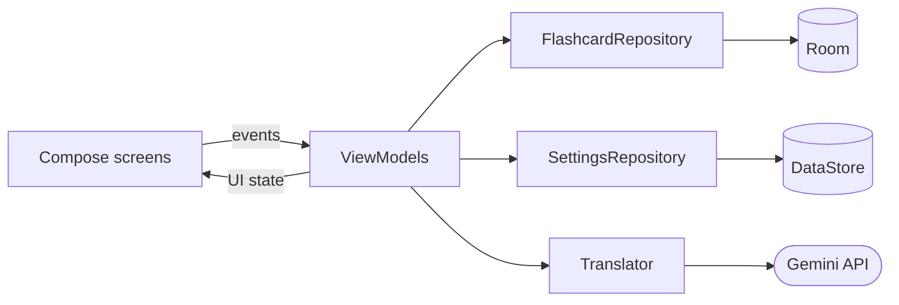

<p align="center">
  
</p>

<h1 align="center">🌊 Language Coast</h1>

<p align="center">
  An AI-powered flashcard app for Android, built with Jetpack Compose and Google Gemini.
</p>

<p align="center">
  <a href="https://github.com/Andreas-Erick/LanguageCoast/actions/workflows/ci.yml"></a>
  
  
  
</p>

---

Language Coast is a flashcard app that changes how you build vocabulary. It combines **Google Gemini** with a coastal-themed UI. Each language you learn gets its own **Coast** (e.g. a *German Coast* and an *Icelandic Coast*). Type what you want to say, and Gemini translates it and files it into one of that coast's "Language Islands", ready to study.

## 📱 Screenshots

<p align="center">
  
  
  
  
  
  
</p>

## ✨ Features

### 🤖 AI-powered card creation
- **Smart translations**: uses Google Gemini (`gemini-2.5-flash` by default, selectable in Settings) for natural, context-aware translations.
- **Auto-categorization**: Gemini sorts each new card into an island such as *Travel*, *Restaurant* or *Greetings*, reusing your existing islands whenever one fits.
- **Icelandic noun rule**: single Icelandic nouns are returned with their definite and plural forms (e.g. *hestur, hesturinn, hestar*).
- **Island emojis**: Gemini also picks an emoji for each new island (🍽️ *Restaurant*, ✈️ *Travel*).
- **Manual mode**: you can skip the AI and enter your own translation and category.
- **Instant preview with undo**: after saving you see the card that was created and can undo it right away.

### 🏝️ My Coasts
- **One coast per language**: study several languages side by side, each with its own islands. Pick which coast new cards go to right on the Create screen.
- **Language Islands**: on each coast, your vocabulary is grouped into islands by category, each with its emoji, card count and when you last studied it.
- **Progress at a glance**: coasts show how many islands you explored this week.
- **Daily streaks**: a streak counter and a dot for each day of the week track your study days.
- **Undo instead of "Are you sure?"**: deleted coasts, islands and cards can be restored from the snackbar.
- **Offline-first storage**: cards are stored locally with **Room**, and preferences with **Jetpack DataStore**.

### 🧠 Study modes
- **Flip Cards**: classic flashcards with an animated flip and large *Again* / *Easy* buttons, or swipe the card left/right. *Again* moves the card to the end of the session.
- **Active Type**: test your recall by typing the translation, then grade the card the same way.
- **Session summary**: finishing an island shows a short celebration with your stats and streak.
- **Built-in dictionary**: tap any word on the back of a card to look it up on **dict.cc**. It uses your language pair when dict.cc has it (dict.cc pairs every language with English or German) and falls back to the English dictionary otherwise.

### 🔔 Study reminders
- A daily reminder, scheduled with **WorkManager**: at a surprise time between 9:00 and 21:00, or at a fixed time you pick in Settings. It can also be turned off.

### 📤 Export & import
- **Export to Anki**: save one coast or all of them as a text file that Anki imports with *File › Import*. Each island becomes a subdeck (e.g. *German Coast::Greetings*).
- **Export to Markdown**: one table per island, to read, print or keep in your notes app.
- **Import from CSV or tab-separated files**, e.g. a spreadsheet or an Anki notes export. A third column (or Anki's deck column) picks the island, a header row is detected, and cards the coast already has are skipped. Imports can be undone.
- Files are saved and opened with the system file picker, so they can go to Downloads, Google Drive and so on. The app needs no storage permission.

**Supported languages:** all 28 dict.cc languages (Albanian, Bosnian, Bulgarian, Croatian, Czech, Danish, Dutch, English, Esperanto, Finnish, French, German, Greek, Hungarian, Icelandic, Italian, Latin, Norwegian, Polish, Portuguese, Romanian, Russian, Serbian, Slovak, Spanish, Swedish, Turkish, Ukrainian), plus Japanese and Korean without dictionary lookup. The language picker can be searched by English or native name (e.g. *Deutsch*, *Suomi*).

## 🛠️ Tech stack

| Area | Library |
| --- | --- |
| Architecture | MVVM: ViewModels + repositories, unidirectional data flow with `StateFlow` |
| Dependency injection | [Hilt](https://developer.android.com/training/dependency-injection/hilt-android) |
| UI | [Jetpack Compose](https://developer.android.com/compose) + Material 3 (100% Kotlin) |
| AI | [Google Gen AI Java SDK](https://github.com/googleapis/java-genai) (Gemini) |
| Database | [Room](https://developer.android.com/training/data-storage/room) |
| Preferences | [Jetpack DataStore](https://developer.android.com/topic/libraries/architecture/datastore) |
| Navigation | [Navigation Compose](https://developer.android.com/jetpack/compose/navigation) with type-safe routes |
| Background work | [WorkManager](https://developer.android.com/topic/libraries/architecture/workmanager) |
| Testing | JUnit 4, kotlinx-coroutines-test, hand-written fakes |
| CI/CD | GitHub Actions (tests on every push, signed APK on every release tag) |

## 🏗️ Architecture



- **Screens** are stateless: they render a UI state and forward user events to their ViewModel.
- **ViewModels** hold the screen logic, e.g. `StudyViewModel` runs the study session (*Again* re-queues a card, *Easy* removes it, completing a session updates the streak).
- **Repositories** are interfaces with one production implementation each, provided by Hilt. Tests swap them for in-memory fakes, so all ViewModel logic is tested without a device.

## 📁 Project structure

```
app/src/main/java/com/andreaserick/languagecoast/
├── MainActivity.kt          # Entry point, bottom navigation and NavHost
├── data/                    # Repositories, Room entities/DAO, DataStore settings, Gemini translator
├── di/                      # Hilt modules
├── navigation/              # Type-safe route definitions
├── notifications/           # Daily study reminder (WorkManager + notification)
├── ui/
│   ├── coast/               # Each feature has a Screen + ViewModel
│   ├── components/          # Shared composables (screen header, language picker, dropdown, undo snackbar)
│   ├── create/
│   ├── mycoast/
│   ├── settings/
│   ├── study/
│   └── theme/               # Colors, typography and Material theme
└── util/                    # dict.cc lookup helpers
```

## 🚀 Getting started

### Prerequisites
- A recent version of **Android Studio** that supports Android Gradle Plugin 9.2.
- **JDK 21** (Gradle can download it automatically through the toolchain resolver).
- A **Google Gemini API key**, which you can get from [Google AI Studio](https://aistudio.google.com/). It is only needed for AI mode.

### Setup
1. Clone the repository:
   ```bash
   git clone https://github.com/Andreas-Erick/LanguageCoast.git
   ```
2. Open the project in Android Studio and let Gradle sync.
3. Run the app on an emulator or a physical device (Android 8.0 / API 26 or higher).
4. Open **Settings**, choose your native language, and paste your **Gemini API key**.
5. Start a coast for the language you want to learn, then create your first island!

> **Your API key stays on your device.** The app keeps it in local app storage (DataStore). It is never compiled into the app, so you don't need to add it to `local.properties`.

### Running tests
```bash
./gradlew testDebugUnitTest
```
The unit tests cover the ViewModels, the streak rules, prompt building and response parsing. They run on every push via GitHub Actions.

## 📦 Releases

Signed APKs are published on the [Releases](https://github.com/Andreas-Erick/LanguageCoast/releases) page. Download the APK on an Android device to install it. You may need to allow installs from unknown sources.

<details>
<summary>How releases are built (for maintainers)</summary>

Pushing a tag such as `v1.0` runs the [release workflow](.github/workflows/release.yml), which builds a signed APK and attaches it to a GitHub Release:

```bash
git tag v1.0
git push origin v1.0
```

The version name comes from the tag (`v1.0` → `1.0`) and the version code from the workflow run number, so there is no need to edit `build.gradle.kts` before a release.

The workflow needs these repository secrets (*Settings → Secrets and variables → Actions*): `KEYSTORE_BASE64`, `KEYSTORE_PASSWORD`, `KEY_ALIAS` and `KEY_PASSWORD`.

To sign release builds locally, place a `keystore.properties` file in the project root (it is git-ignored):

```properties
storeFile=release-keystore.jks
storePassword=...
keyAlias=...
keyPassword=...
```
</details>

## 🎨 Design

Language Coast uses a deep-sea color palette:
- **Deep Ocean Blue**: the app's main background.
- **Sand Beige**: warm, readable text and primary accents.
- **Coral & Wave Teal**: bright highlights for interactive elements and feedback.
- **Card tints**: sky, seafoam, dune and shell for coasts and islands.

Text colors are checked against the WCAG contrast guidelines (at least 4.5:1 for normal text). Headings use [Nunito](https://github.com/googlefonts/nunito), licensed under the [SIL Open Font License](docs/licenses/Nunito-OFL.txt).

---

<p align="center"><i>"Build your coast, one word at a time."</i> 🌊⚓</p>
